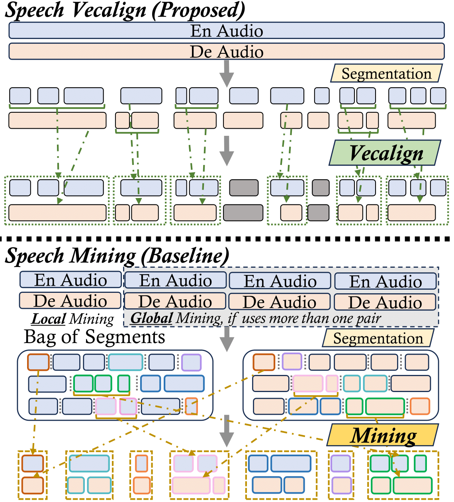

# Speech Vecalign


[](https://arxiv.org/abs/2509.18360)

This repository contains code and data for the paper [**Speech Vecalign: an Embedding-based Method for Aligning Parallel Speech Documents**](https://arxiv.org/abs/2509.18360) 
(accepted by EMNLP 2025 main).

## Introduction

**Speech Vecalign** monotonically aligns **parallel** speech documents based on speech segment embeddings and does not depend on text transcriptions.

This repository is the implementation of the complete Speech Vecalign pipeline, including Speech Preprocessing, Speech Segment Alignment, and Alignment Postprocessing.
Details can be found in the paper.



## How to use the provided VoxPopuli alignments?
You can download the metadata from the links below.

| Metadata                                                                                          |
|---------------------------------------------------------------------------------------------------|
| [en-to-de](https://drive.google.com/file/d/1D0tFvPmSAVUPXTq0U7hU-kNripm4fTWI/view?usp=drive_link) |
| [de-to-en](https://drive.google.com/file/d/1LNQCn8pzV8_D6LWMaLtCAo5GKzjw7Gp0/view?usp=drive_link) |

Each line has the format:
```
margin-score \t src_audio src_start src_end 16 \t tgt_audio tgt_start tgt_end 16
```
For example:
```
1.4214926958084106      raw_audios/de/2018/20181024-0900-PLENARY_de.ogg 514132512 514205664 16  raw_audios/en/2018/20181024-0900-PLENARY_en.ogg 514103328 514174432 16
1.4021071195602417      raw_audios/de/2015/20150609-0900-PLENARY-6_de.ogg 3635232 3668448 16    raw_audios/en/2015/20150609-0900-PLENARY-6_en.ogg 3611680 3648992 16
```

You can download the VoxPopuli dataset following the instructions [here](https://github.com/facebookresearch/voxpopuli?tab=readme-ov-file#unlabelled-data).
Our metadata is in `en` and `de`, so please download the unlabelled data in `en` and `de`.
Each language takes up about 70~80GB storage.

Then, you can extract alignments by:
```python
import gzip
import soundfile as sf
from pathlib import Path

vox_root = Path("")  # where you download VoxPopuli to
metadata = ""  # where the metadata is
with gzip.open(metadata, mode="rt") as fp:
    for line in fp:
        score, src_meta, tgt_meta = line.strip().split("\t")
        src_path, src_s, src_e, _ = src_meta.split(" ")
        tgt_path, tgt_s, tgt_e, _ = tgt_meta.split(" ")

        src_segment, _ = sf.read(
            (vox_root / src_path).as_posix(), start=int(src_s), stop=int(src_e), dtype="float32"
        )
        tgt_segment, _ = sf.read(
            (vox_root / tgt_path).as_posix(), start=int(tgt_s), stop=int(tgt_e), dtype="float32"
        )
```

## Parallel Speech Documents Alignment

This could be a long, tedious pipeline.
We have [an example script](./example/voxpopuli/run.sh) to run all steps.
But try to check all the intermediate outputs to make sure they make sense.

### 1. General Design Choices
As this pipeline is aimed for processing large amounts of data, 
we have some design choices to enable efficient processing.
Most scripts support the following functionalities.
In order to avoid redundancy, we introduce these features here.
Try to have a look at the arguments of each script.
If certain args are supported, then you may want to consider using them.

**Features**:
- **Sharding**.
There can be a large number of input files.
By spliting the inputs into smaller shards, you can run multiple jobs with each processing much fewer inputs.
You can do this by `--rank` and `--n_shard`.
`n_shard` denotes the number of total shards the inputs are split into,
and `rank`, having a range of `[0, n_shard)`, denotes the shard index this job will process.
- **Multi-processing**.
Each single job may process its inputs using multiple processes.
You can use `--n_proc` to denote the number of processes.
Each process will deal with roughly the same number of inputs.
- **Successfully processed inputs won't be re-processed**.
Sometimes a job might get killed accidentally.
For the extremely time-consuming tasks, such as embedding and segment, 
the default behavior is to skip processing the inputs that already have a corresponding output file,
such that it should be safe to simply re-submit the job.
For other easier tasks, just re-run it and the existing outputs will be overwritten.
That won't cost a lot of time anyway.

### 2. Data Preparation
#### Raw Audios
The sampling rate of audios should be `16000`.
And they should have formats that [soundfile](https://pypi.org/project/soundfile/) supports, i.e., `.wav`, `.flac`, `.ogg`.

It is recommended to store audio files by language, i.e., `data_dir/en/file_name.ogg`.

#### Metadata
The input metadata is a tsv file containing paired audios that are to be aligned.

The format is as follows:
```
/path/to/data/de/0000001.ogg   /path/to/data/en/0000001.ogg
/path/to/data/de/0000002.ogg   /path/to/data/en/0000001.ogg
/path/to/data/de/0000003.ogg   /path/to/data/en/0000002.ogg
```

We provide a toy example of aligning a single pair of speech documents.
The metadata is provided in [example/voxpopuli/metadata.tsv](./example/voxpopuli/metadata.tsv).
The source (left) side is English and the target (right) side is German.

### 3. Installation
#### Basic packages
We used the following packages in our paper:
```shell
conda create -n svecalign python=3.9
pip install numpy==1.26.4
pip install torch==1.12.1 torchaudio==0.12.1  # pytorch
pip install tqdm soundfile
git clone https://github.com/facebookresearch/stopes.git && cd stopes && pip install -e . && cd ..
pip install requests==2.31.0
pip install librosa  # additional packages for stopes, although they are not explicitly used...
conda install -c pytorch -c nvidia faiss-gpu=1.7.3
```
More recent versions also work (e.g., python 3.10 and pytorch 2.6.0), but they will produce different results.
It does not mean that our results (e.g., the [examples](./example) we provide) are optimal.
It is just a reminder that you may want to double check the outputs yourself to make sure they make sense.
You are encouraged to use recent versions, as they should perform better...

You probably will encounter an error about the version of `hydra-core` if you use `pip>=25`.
You can switch to `pip<=24` to avoid this issue.

#### Additional packages
These are for speech embeddings (choose **either** one, but don't install both in a single environment to avoid conflicts):

**a. SpeechLASER**:
```shell
git clone https://github.com/facebookresearch/fairseq.git && cd fairseq && pip install --editable ./ && cd ..
```

**b. SONAR**:
```shell
conda create -n sonar python=3.10  # >= 3.10
pip install fairseq2==0.4.6  # this will automatically install pytorch 2.6
pip install sonar-space==0.4.0
conda install -c conda-forge libsndfile==1.0.31
```

### 4. Speech Preprocessing
#### 4.1 Speech segmentation
We apply [Silero VAD](https://github.com/snakers4/silero-vad) to each speech file.

Note that the segmentation results _may_ vary if a different pytorch or `silero-vad` version is used.
`snakers4/silero-vad:v4.0` should reproduce our results.

```shell
python -m svecalign.preprocess.segment \
    ./example/voxpopuli/metadata.tsv \
    /path/to/output/dir \
    --lang en \
    [--vad_version snakers4/silero-vad] \ 
    [--use_tgt] \
    [--rank 0 --n_shard 1]
```
- If `--use_tgt`, the target files will be segmented. In this example, use it when segmenting `de` audios.
- `--vad_version`: denotes the version of silero-vad. We used `snakers4/silero-vad:v4.0`, which is a pretty old version.
By default, it should be the latest version.
- The output files (stored as `${out_dir}/${lang}/${file_name}.txt`) contain lines of start and end timestamps of detected speech parts.
Timestamps are separated by a space.
Example is provided in [example/voxpopuli/segments](./example/voxpopuli/segments).

#### 4.2 Detect identical untranslated segments (Optional)
The goal is to find whether there are identical untranslated segments in the source and target documents.
The detected ones will not be aligned in the alignment process later.

Two segments are classified as identical if:
- They have about the same midpoint timestamps (e.g., both at ~1min10s);
- They have similar durations;
- They have similar fbanks.

```shell
python -m svecalign.preprocess.detect_untranslate_segs \
    ./example/voxpopuli/metadata.tsv \
    /path/to/output/dir \
    --seg_dir ./example/voxpopuli/segments \
    --src_lang en --tgt_lang de \
    [--n_proc 1]
```
- The output files (stored as `${out_dir}/${src_lang}-${tgt_lang}/${src_filename}-${tgt_filename}.{src, tgt}.txt`)
contain indices of the identical untranslated segments.
Example is provided in [example/voxpopuli/untrans_segs](./example/voxpopuli/untrans_segs).

### 5. Speech Segment Alignment
#### 5.1 Concatenate consecutive segments
To create segments of different granularity, we concatenate consecutive segments by
```shell
python -m svecalign.seg_align.concat_segs \
    ./example/voxpopuli/metadata.tsv \
    /path/to/output/dir \
    --seg_dir ./example/voxpopuli/segments \
    --lang en \
    [--num_overlaps 5 --max_dur 20.0] \
    [--use_tgt]
```
- The output files (stored as `${out_dir}/${lang}/${file_name}.txt`) have the same format as the segment files.
Each line contains start and end timestamps, separated by a space.
- `--num_overlaps x`: the maximum number of consecutive segments can be concatenated.
- `--max_dur y` the maximum duration of concatenated segment.
- Example is in [example/voxpopuli/cat_segs](./example/voxpopuli/cat_segs).

#### 5.2 Obtain the indices of concatenated segments that contain identical untranslated segments (Optional)
Previously, we have detected the ids of identical untranslated source and target segments.
Here, we need to also obtain the ids of _concatenated_ segments containing such segments, 
so that their corresponding embeddings will be treated as 0-valued vectors later.

```shell
python -m svecalign.seg_align.detect_untranslate_concats \
    ./example/voxpopuli/metadata.tsv \
    /path/to/output/dir \
    --seg_dir ./example/voxpopuli/segments \
    --identical_seg_dir ./example/voxpopuli/untrans_segs \
    --src_lang en --tgt_lang de \
    [--num_overlaps 5 --max_dur 20.0]
```
- The output files (stored as `${out_dir}/${src_lang}-${tgt_lang}/${src_filename}-${tgt_filename}.{src, tgt}.txt`)
contain lines of starting and ending indices.
For example, the line `10 14` means the concatenation of the 10th segment through the 14th segment and beyond (including 10-14, 10-15, 10-16, ...)
will be represented by 0-valued vectors.
- `--num_overlaps` and `--max_dur` should be the same as [Step 5.1](#51-concatenate-consecutive-segments).
- Example is in [example/voxpopuli/untrans_cat_seg_ids](./example/voxpopuli/untrans_cat_seg_ids).

#### 5.3 Segment embedding
We support SpeechLASER and SONAR embedding.
It is recommended to store these embeddings in fp16 (by default) to save disk space.
- SpeechLASER: you can download models from [here](https://github.com/facebookresearch/fairseq/blob/ust/examples/speech_matrix/speech_laser_encoders.md#speechlaser-encoders),
and save them in `/dir/to/speech_laser/models`.
The output embedding files will be stored as a special [`stoes.utils.embedding_utils.Embedding`](https://github.com/facebookresearch/stopes/blob/main/stopes/utils/embedding_utils.py#L26C7-L26C16) object.
Please use `--is_stopes_embed` in the following steps.
- SONAR: the output embeddings are stored as a numpy array.

```shell
python -m svecalign.seg_align.embed \
    ./example/voxpopuli/metadata.tsv \
    /path/to/output/dir \
    --concat_dir ./example/voxpopuli/cat_segs/ \
    --lang en \
    --embed_model_type speech_laser \
    --sl_ckpt_dir /dir/to/speech_laser/models --sl_ckpt_name english.pt \
    [--use_tgt] \
    [--rank 0 --n_shard 1]
```
- The output files are stored as `${out_dir}/${lang}/${filename}.embed`.
- The of SpeechLASER embedding examples are provided in [example/voxpopuli/embeds](./example/voxpopuli/embeds).

#### 5.4 Apply Vecalign to embeddings
The core alignment functions are based on [Vecalign](https://github.com/thompsonb/vecalign).
```shell
python -m svecalign.seg_align.align \
    ./example/voxpopuli/metadata.tsv \
    /path/to/output/dir \
    --src_lang en --tgt_lang de \
    --seg_dir ./example/voxpopuli/segments \
    --concat_dir ./example/voxpopuli/cat_segs/ \
    --embed_dir ./example/voxpopuli/embeds \
    --is_stopes_embed \
    --fp16_embed \
    -a 6 \
    [--ign_indices_dir ./example/voxpopuli/untrans_cat_seg_ids] \
```
- This will produce an initial alignment, stored as `${out_dir}/${src_lang}-${tgt_lang}/${src_filename}-${tgt_filename}.txt`.
An example is provided in [example/voxpopuli/alignments](./example/voxpopuli/alignments).
- `-a`: the maximum number of segments (src + tgt) in an alignment. Basically, will be equal to `num_overlaps + 1` 
where `num_overlaps` is the number used in [Section 5.1](#51-concatenate-consecutive-segments).
- File format: each line contains `[src segment ids]:[tgt segment ids]:cost`. A lower cost indicates better quality.
-  `--is_stopes_embed`: if set, will use stopes to load embeddings (for SpeechLASER). Otherwise, use numpy (for SONAR).


You can evaluate the output with the `groundtruth`:
```shell
python -m svecalign.vecalign.score \
    -t ./example/voxpopuli/alignments/en-de/20180313-0900-PLENARY-15_en-20180313-0900-PLENARY-15_de.txt \
    -g ./example/voxpopuli/20180313-0900-PLENARY-15.gold
```
The output would be similar to:
```
 ---------------------------------
|             |  Strict |    Lax  |
| Precision   |   0.558 |   0.942 |
| Recall      |   0.632 |   0.993 |
| F1          |   0.593 |   0.967 |
 ---------------------------------
```

Also, once you have these raw alignments, you can debug them first by following [analysis/README.md](./analysis/README.md#transcribe-alignments-using-whisper).

### 6. Alignment Postprocessing
After alignment, we still want to apply some postprocessing to further clean up the alignments and make them suitable for model training.

#### 6.1 Filter by dp cost
This step filters (1) un-aligned segments due to deletion; (2) alignments with high costs.
We used a cost threshold of 0.7.
```shell
python -m svecalign.postprocess.filter_by_cost \
    ./example/voxpopuli/metadata.tsv \
    /path/to/output/dir \
    --align_dir ./example/voxpopuli/alignments \
    --max_cost 0.7 \
    --src_lang en --tgt_lang de
```
The output file format follows the input alignment files.
An example is provided in [example/voxpopuli/align_0.7](./example/voxpopuli/align_0.7).

Evaluation now would be similar to:
```
 ---------------------------------
|             |  Strict |    Lax  |
| Precision   |   0.593 |   0.972 |
| Recall      |   0.632 |   0.978 |
| F1          |   0.612 |   0.975 |
 ---------------------------------
```

#### 6.2 Filter identical untranslated segments, again
Previous heuristics in 4.2 may fail.
We do another check here.
```shell
python -m svecalign.postprocess.filter_untrans_align \
    ./example/voxpopuli/metadata.tsv \
    /path/to/output/dir \
    --align_dir ./example/voxpopuli/align_0.7 \
    --src_lang en --tgt_lang de \
    --seg_dir ./example/voxpopuli/segments \
    [--n_proc 1] [--save_audio]
```
- The output file format follows the input alignment files. 
An example is provided in [example/voxpopuli/align_0.7_clean](./example/voxpopuli/align_0.7_clean).
- `--save_audio`: if set, will save the detected segments as `ogg` files to the disk, so that you can listen to them
and make sure they are indeed identical untranslated segments.

#### 6.3 Concatenate consecutive alignments
The raw alignments are too short and not suitable for model training.
We concatenate consecutive ones to create longer ones.

In our paper, we concatenated 3 consecutive alignments maximum.
```shell
python -m svecalign.postprocess.concat_aligns \
    ./example/voxpopuli/metadata.tsv \
    /path/to/output/dir \
    --max_num_align 3 \
    --align_dir ./example/voxpopuli/align_0.7_clean \
    --seg_dir ./example/voxpopuli/segments \
    --src_lang en --tgt_lang de \
    --apply_dur_cond_to_both_sides \
    [--max_dur 20.0]
```
- The output file format follows the input alignment files. 
An example is provided in [example/voxpopuli/align_0.7_clean_cat3](./example/voxpopuli/align_0.7_clean_cat3).
- `--apply_dur_cond_to_both_sides`: if set, apply the duration constraint (e.g., 20 sec) to the target side
as well.

#### 6.4 Filter short alignments
We keep alignments whose _both_ source and target segments are longer than 1 sec.
This is inspired by SpeechMatrix.
The hypothesis is segments shorter than 1 sec are unlikely to be aligned.
And embeddings for short segments are probably not good.

```shell
python -m svecalign.postprocess.filter_by_dur \
    ./example/voxpopuli/metadata.tsv \
    /path/to/output/dir \
    --align_dir ./example/voxpopuli/align_0.7_clean_cat3 \
    --seg_dir ./example/voxpopuli/segments \
    --src_lang en --tgt_lang de \
    [--min_dur 1.0]
```
- The output file format follows the input alignment files. 
An example is provided in [example/voxpopuli/align_0.7_clean_cat3_min1s](./example/voxpopuli/align_0.7_clean_cat3_min1s).

#### 6.5 Embed concatenated alignments
We want to compute margin-scores for all alignments, including the concatenated ones, so we
first compute embeddings for them.
Most embeddings have already been computed in [Section 5.3](#53-segment-embedding).
We do **not** re-compute or re-store them.
Instead, we use "references" pointing to the existing embeddings.
We only compute for the new alignments, so the process should be fast.

**Note**:
Please use the **same** embedding setup (embedding model, dtype, etc.) as [Section 5.3](#53-segment-embedding).

```shell
python -m svecalign.postprocess.embed_align \
    ./example/voxpopuli/metadata.tsv \
    /path/to/output/dir \
    --src_lang en --tgt_lang de \
    --align_dir ./example/voxpopuli/align_0.7_clean_cat3_min1s \
    --seg_dir ./example/voxpopuli/segments \
    --concat_seg_dir ./example/voxpopuli/cat_segs \
    --concat_seg_embed_dir ./example/voxpopuli/embeds \
    --embed_model_type speech_laser \
    --sl_ckpt_dir /dir/to/speech_laser/models --sl_ckpt_name english.pt \
    [--use_tgt]
```
- An example output is provided in [example/voxpopuli/align_0.7_clean_cat3_min1s_embed](./example/voxpopuli/align_0.7_clean_cat3_min1s_embed).
It contains embeddings (`*.embed`) and tsvs (`*.tsv`).
The embedding files contain embeddings to the new segments.
The tsv files contain "pointers" to both old embeddings and new embeddings.
- `--use_tgt`: If set, embed the target language.

#### 6.6 Train indexes
In practice, the number of embeddings is huge (millions ~ tens of millions, or more).
Therefore, we have to train indexes using stopes.

```shell
python -m svecalign.postprocess.prep_index \
    ./example/voxpopuli/metadata.tsv \
    /path/to/output/dir \
    --data_dir ./example/voxpopuli/align_0.7_clean_cat3_min1s_embed \
    --src_lang en --tgt_lang de \
    --embed_fp16 \
    [--sample_ratio 0.5] [--embed_stopes] \
    [--use_tgt]
```
- Example output is provided in [example/voxpopuli/align_0.7_clean_cat3_min1s_embed_indexes](./example/voxpopuli/align_0.7_clean_cat3_min1s_embed_indexes).
The sampled embedding file is ignored.
The most important files are the two indexes (`${index_type}.populate.idx`).
- `--sample_ratio`: will sample this ratio of embeddings to train indexes. Values around 0.3~0.5 might be enough.
- `--embed_stopes`: if set, will use stopes to load embeddings (for SpeechLASER). Otherwise, use numpy (for SONAR).
- `--use_tgt`: If set, will train indexes for the target language.

#### 6.7 Compute margin-scores
With the trained indices, we now compute margin-scores for the alignments.

```shell
python -m svecalign.postprocess.score_align \
    ./example/voxpopuli/metadata.tsv \
    /path/to/output/dir \
    --embed_dir ./example/voxpopuli/align_0.7_clean_cat3_min1s_embed \
    --align_dir ./example/voxpopuli/align_0.7_clean_cat3_min1s \
    --src_lang en --tgt_lang de \
    --index_dir ./example/voxpopuli/align_0.7_clean_cat3_min1s_embed_indexes \
    --embed_fp16 \
    [--embed_stopes]
```
- Example output is in [example/voxpopuli/align_0.7_clean_cat3_min1s_margin](./example/voxpopuli/align_0.7_clean_cat3_min1s_margin).
The format is again Vecalign style.
- `--embed_stopes`: if set, will use stopes to load embeddings (for SpeechLASER). Otherwise, use numpy (for SONAR).

#### 6.8 Prepare the tsv file
Convert the alignment files into a single tsv file, which has the format of:
```
score \t src_audio_path start_frame end_frame 16 \t tgt_audio_path start_frame end_frame 16
```

```shell
python -m svecalign.postprocess.prep_tsv \
    ./example/voxpopuli/metadata.tsv \
    /path/to/output/dir \
    --src_lang en --tgt_lang de \
    --align_dir ./example/voxpopuli/align_0.7_clean_cat3_min1s_margin \
    --seg_dir ./example/voxpopuli/segments
```
- Example output is [example/voxpopuli/align_0.7_clean_cat3_min1s_tsvs/en-de/align.tsv.gz](./example/voxpopuli/align_0.7_clean_cat3_min1s_tsvs/en-de/align.tsv.gz).


#### 6.9 Remove overlapped alignments
This is following SpeechMatrix.
We want to remove alignments that overlap too much with others.
We use a threshold of `0.8`.

```shell
python -m svecalign.postprocess.remove_overlaps \
    --output_dir /path/to/output/dir \
    --output_filename align.rm_overlap.tsv.gz \
    --mining_result_path ./example/voxpopuli/align_0.7_clean_cat3_min1s_tsvs/en-de/align.tsv.gz \
    --min_audio_length 2000 \
    --mining_threshold 0.0 \
    --max_overlap 0.8
```
- Example output is [example/voxpopuli/align_0.7_clean_cat3_min1s_tsvs/en-de/align.rm_overlap.tsv.gz](./example/voxpopuli/align_0.7_clean_cat3_min1s_tsvs/en-de/align.rm_overlap.tsv.gz).
- For the arguments, please read the help message of the script.

#### 6.10 Sort the tsv by margin-scores
We sort the tsv files by the first column, so that you can choose the training set from the top to the bottom.

```shell
python -m svecalign.postprocess.sort_tsv \
    --in_tsv ./example/voxpopuli/align_0.7_clean_cat3_min1s_tsvs/en-de/align.rm_overlap.tsv.gz \
    --out_tsv /path/to/output/tsv
```
- Example output is [example/voxpopuli/align_0.7_clean_cat3_min1s_tsvs/en-de/align.rm_overlap.sort.tsv.gz](./example/voxpopuli/align_0.7_clean_cat3_min1s_tsvs/en-de/align.rm_overlap.sort.tsv.gz).


## Acknowledgement
This codebase is partially based on [Vecalign](https://github.com/thompsonb/vecalign) and [stopes](https://github.com/facebookresearch/stopes).

## Citation
If you find this repository helpful, please cite the following article:
```
@misc{meng2025speechvecalignembeddingbasedmethod,
      title={{Speech Vecalign: an Embedding-based Method for Aligning Parallel Speech Documents}}, 
      author={Chutong Meng and Philipp Koehn},
      year={2025},
      eprint={2509.18360},
      archivePrefix={arXiv},
      primaryClass={cs.CL},
      url={https://arxiv.org/abs/2509.18360}, 
}
```

## License
For the code we borrowed from Vecalign, they will be under the original [Apache License, Version 2.0 license](https://github.com/thompsonb/vecalign/blob/master/LICENSE).
The rest is under MIT license.
